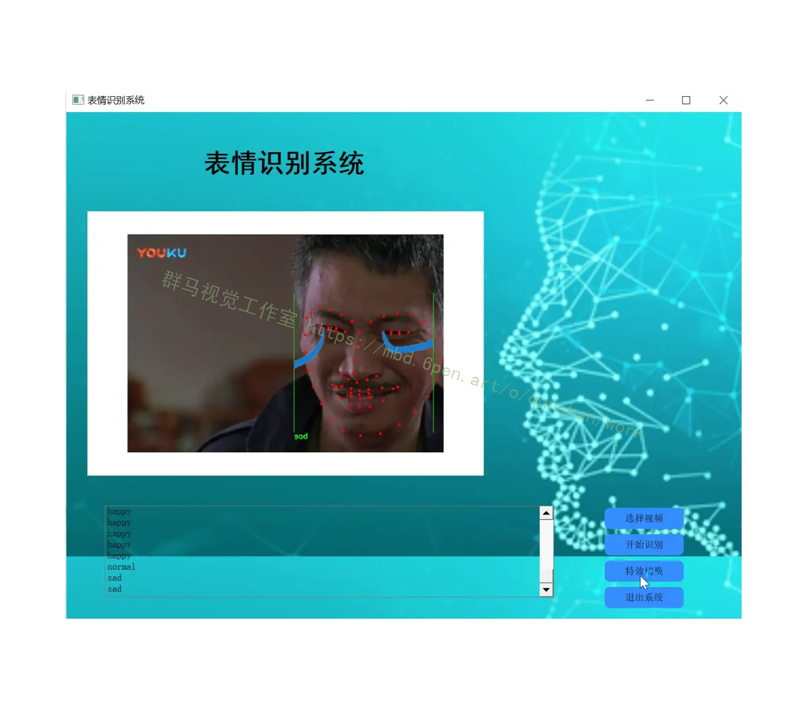

## 1.研究背景与意义


随着计算机视觉和人工智能技术的不断发展，表情识别系统在各个领域中得到了广泛的应用。表情是人类情感的重要表达方式之一，通过识别和理解人脸表情，计算机可以更好地与人类进行交互，从而提升用户体验和服务质量。基于OpenCV的表情识别系统成为了当前研究的热点之一。

首先，表情识别系统在人机交互领域具有重要的应用价值。人机交互是计算机科学与心理学交叉的研究领域，通过分析和理解人类的表情，计算机可以更好地感知用户的情感状态，从而提供更加智能化和个性化的服务。例如，在智能客服系统中，通过识别用户的表情，系统可以根据用户的情感状态调整回答的语气和方式，提供更加贴心和人性化的服务。

其次，表情识别系统在心理学和情感研究领域具有重要的研究价值。情感是人类心理活动的重要组成部分，通过分析和理解人类的表情，可以更好地研究人类的情感变化和心理状态。例如，在心理疾病的诊断和治疗中，通过分析患者的表情变化，可以更准确地判断患者的情感状态，从而制定更有效的治疗方案。

此外，表情识别系统在安全监控和人脸识别领域也具有重要的应用价值。通过识别人脸表情，可以更好地判断人类的情感状态，从而提升安全监控系统的准确性和效率。例如，在公共场所的安全监控中，通过识别人脸表情，可以及时发现异常情况，提前采取相应的措施。同时，在人脸识别领域，通过结合表情识别技术，可以提高人脸识别系统的鲁棒性和准确性，提升系统的实用性和可靠性。

基于OpenCV的表情识别系统具有以下特点和优势。首先，OpenCV是一个开源的计算机视觉库，具有丰富的图像处理和分析功能，可以方便地进行人脸检测和表情识别。其次，OpenCV支持多种编程语言，如C++、Python等，可以满足不同开发者的需求。此外，OpenCV还具有较好的跨平台性能，可以在不同的操作系统和硬件平台上运行。

综上所述，基于OpenCV的表情识别系统在人机交互、心理学研究、安全监控和人脸识别等领域具有广泛的应用价值。通过深入研究和开发这一系统，可以推动计算机视觉和人工智能技术的发展，提升人机交互的智能化水平，促进人类社会的进步和发展。

# 2.图片演示





# 3.视频演示
[Python+OpenCV表情识别系统（源码和部署教程）_哔哩哔哩_bilibili](https://www.bilibili.com/video/BV12w411X7Tt/?vd_source=ff015de2d29cbe2a9cdbfa7064407a08)

# 4.表情识别系统流程
自动表情识别系统包括人脸图像获取、人脸检测、表情图像预处理、表情特征提取与分类识别等六部分。构建表情识别系统首先获取包含人脸的图像。其次检测出人脸并截取人脸表情图像，并且对人脸表情图像进行几何及光照等预处理。最后根据预处理后的表情图像提取表情特征，并对特征进行分类识别。


## 5.核心代码讲解

#### 5.1 test.py

封装为类的代码如下：

```python


class FaceMask:
    def __init__(self, predictor_path, mask_path):
        self.detector = dlib.get_frontal_face_detector()
        self.predictor = dlib.shape_predictor(predictor_path)
        self.mask = cv2.imread(mask_path, cv2.IMREAD_UNCHANGED)

    def add_alpha_channel(self, img):
        b_channel, g_channel, r_channel = cv2.split(img)
        alpha_channel = np.ones(b_channel.shape, dtype=b_channel.dtype) * 255
        img_new = cv2.merge((b_channel, g_channel, r_channel, alpha_channel))
        return img_new

    def merge_img(self, jpg_img, png_img, y1, y2, x1, x2):
        if jpg_img.shape[2] == 3:
            jpg_img = self.add_alpha_channel(jpg_img)

        yy1 = 0
        yy2 = png_img.shape[0]
        xx1 = 0
        xx2 = png_img.shape[1]

        if x1 < 0:
            xx1 = -x1
            x1 = 0
        if y1 < 0:
            yy1 = -y1
            y1 = 0
        if x2 > jpg_img.shape[1]:
            xx2 = png_img.shape[1] - (x2 - jpg_img.shape[1])
            x2 = jpg_img.shape[1]
        if y2 > jpg_img.shape[0]:
            yy2 = png_img.shape[0] - (y2 - jpg_img.shape[0])
            y2 = jpg_img.shape[0]

        alpha_png = png_img[yy1:yy2, xx1:xx2, 3] / 255.0
        alpha_jpg = 1 - alpha_png

        for c in range(0, 3):
            jpg_img[y1:y2, x1:x2, c] = ((alpha_jpg * jpg_img[y1:y2, x1:x2, c]) + (alpha_png * png_img[yy1:yy2, xx1:xx2, c]))

        return jpg_img

    def apply_mask(self, image_path):
        im_rd = cv2.imread(image_path, cv2.IMREAD_UNCHANGED)
        img_gray = cv2.cvtColor(im_rd, cv2.COLOR_RGB2GRAY)
        faces = self.detector(img_gray, 0)

        if len(faces) != 0:
            for i in range(len(faces)):
                for k, d in enumerate(faces):
                    cv2.rectangle(im_rd, (d.left(), d.top()), (d.right(), d.bottom()), (0, 255, 0))
                    face = im_rd[d.top():d.bottom(), d.left():d.right()]
                    mask = cv2.resize(self.mask, (face.shape[1], face.shape[0]))
                    face_width = d.right() - d.left()
                    shape = self.predictor(im_rd, d)
                    mouth_width = (shape.part(54).x - shape.part(48).x) / face_width
                    mouth_higth = (shape.part(66).y - shape.part(62).y) / face_width
                    for i in range(68):
                        cv2.circle(im_rd, (shape.part(i).x, shape.part(i).y), 4, (0, 0, 255), -1, 2)
                    x1 = d.left()
                    y1 = d.top()
                    x2 = x1 + face.shape[1]
                    y2 = y1 + face.shape[0]
                    res_img = self.merge_img(im_rd, mask, y1, y1 + mask.shape[0], x1, x1 + mask.shape[1])
        cv2.imshow('out', res_img)
        cv2.waitKey(0)
```


该程序文件名为test.py，主要功能是将一个透明的png图像叠加到一个jpg图像上，并在人脸部分进行特效处理。

程序首先导入了需要使用的库，包括PIL、cv2、dlib和numpy。然后定义了一个函数add_alpha_channel，用于为jpg图像添加alpha通道。接着定义了一个函数merge_img，用于将png透明图像与jpg图像叠加在一起。然后读取了两个图像文件，一个是jpg图像im_rd，一个是png图像mask。

接下来，程序将jpg图像转换为灰度图像，并使用人脸检测器检测图像中的人脸，返回人脸的位置信息。如果检测到人脸，则遍历每个人脸，用矩形框出人脸，并计算人脸的一些特征参数。然后根据人脸的位置信息，将png图像resize到与人脸大小相同，并将其叠加到jpg图像上。最后显示叠加后的图像。

整个程序的功能是将一个透明的png图像叠加到一个jpg图像上，并在人脸部分进行特效处理。

#### 5.2 test2.py
```
```python

class ImageMerger:
    def __init__(self, jpg_img_path, png_img_path):
        self.jpg_img_path = jpg_img_path
        self.png_img_path = png_img_path

    def add_alpha_channel(self, img):
        """ 为jpg图像添加alpha通道 """
        b_channel, g_channel, r_channel = cv2.split(img)  # 剥离jpg图像通道
        alpha_channel = np.ones(b_channel.shape, dtype=b_channel.dtype) * 255  # 创建Alpha通道
        img_new = cv2.merge((b_channel, g_channel, r_channel, alpha_channel))  # 融合通道
        return img_new

    def merge_img(self, y1, y2, x1, x2):
        """ 将png透明图像与jpg图像叠加
            y1,y2,x1,x2为叠加位置坐标值
        """
        # 读取图像
        img_jpg = cv2.imread(self.jpg_img_path, cv2.IMREAD_UNCHANGED)
        img_png = cv2.imread(self.png_img_path, cv2.IMREAD_UNCHANGED)

        # 判断jpg图像是否已经为4通道
        if img_jpg.shape[2] == 3:
            img_jpg = self.add_alpha_channel(img_jpg)

        '''
        当叠加图像时，可能因为叠加位置设置不当，导致png图像的边界超过背景jpg图像，而程序报错
        这里设定一系列叠加位置的限制，可以满足png图像超出jpg图像范围时，依然可以正常叠加
        '''
        yy1 = 0
        yy2 = img_png.shape[0]
        xx1 = 0
        xx2 = img_png.shape[1]

        if x1 < 0:
            xx1 = -x1
            x1 = 0
        if y1 < 0:
            yy1 = - y1
            y1 = 0
        if x2 > img_jpg.shape[1]:
            xx2 = img_png.shape[1] - (x2 - img_jpg.shape[1])
            x2 = img_jpg.shape[1]
        if y2 > img_jpg.shape[0]:
            yy2 = img_png.shape[0] - (y2 - img_jpg.shape[0])
            y2 = img_jpg.shape[0]

        # 获取要覆盖图像的alpha值，将像素值除以255，使值保持在0-1之间
        alpha_png = img_png[yy1:yy2, xx1:xx2, 3] / 255.0
        alpha_jpg = 1 - alpha_png

        # 开始叠加
        for c in range(0, 3):
            img_jpg[y1:y2, x1:x2, c] = ((alpha_jpg * img_jpg[y1:y2, x1:x2, c]) + (alpha_png * img_png[yy1:yy2, xx1:xx2, c]))

        return img_jpg

```

这个程序文件名为test2.py，主要实现了两个函数：add_alpha_channel和merge_img。

add_alpha_channel函数用于为jpg图像添加alpha通道。它首先将jpg图像的通道分离成蓝色通道、绿色通道和红色通道，然后创建一个与蓝色通道形状相同的alpha通道，像素值全部设置为255。最后将蓝色通道、绿色通道、红色通道和alpha通道合并成一个新的图像，并返回。

merge_img函数用于将png透明图像与jpg图像叠加。它首先判断jpg图像是否已经为4通道，如果不是则调用add_alpha_channel函数为其添加alpha通道。然后根据叠加位置的坐标值，设定一系列叠加位置的限制，以防止png图像超出jpg图像范围导致程序报错。接着获取要覆盖图像的alpha值，并将其除以255，使值保持在0-1之间。最后进行叠加操作，将jpg图像和png图像按照alpha值进行加权融合。最后返回叠加后的jpg图像。

在主程序中，首先定义了图像路径，然后使用cv2.imread函数读取图像。接着设置叠加位置的坐标值，调用merge_img函数进行叠加操作。最后使用cv2.imshow函数显示结果图像，并使用cv2.waitKey函数等待按键操作。

#### 5.3 ui.py

```python

def add_alpha_channel(img):
    """ 为jpg图像添加alpha通道 """
    b_channel, g_channel, r_channel = cv2.split(img)  # 剥离jpg图像通道
    alpha_channel = np.ones(b_channel.shape, dtype=b_channel.dtype) * 255  # 创建Alpha通道
    img_new = cv2.merge((b_channel, g_channel, r_channel, alpha_channel))  # 融合通道
    return img_new

def merge_img(jpg_img, png_img, y1, y2, x1, x2):
    """ 将png透明图像与jpg图像叠加
        y1,y2,x1,x2为叠加位置坐标值
    """
    # 判断jpg图像是否已经为4通道
    if jpg_img.shape[2] == 3:
        jpg_img = add_alpha_channel(jpg_img)

```
这个程序文件是一个基于PyQt5的表情识别系统。程序的主要功能是通过摄像头或者选择视频文件进行表情识别，并在界面上显示识别结果。程序使用了OpenCV、dlib和numpy等库来进行图像处理和人脸识别。程序界面使用了Qt框架来实现。

程序的主要逻辑是通过调用摄像头或者读取视频文件的帧图像，然后使用人脸检测器检测图像中的人脸。对于每个检测到的人脸，程序会计算嘴巴的张开程度、眉毛的皱起程度等特征，并根据这些特征判断表情的类别。根据表情的类别，程序会在图像上显示相应的文字，并可以选择添加特效。

程序的界面由一个主窗口和几个按钮组成。点击选择视频按钮可以选择要识别的视频文件，点击开始识别按钮可以开始进行表情识别，点击特效切换按钮可以切换是否添加特效，点击退出系统按钮可以退出程序。

程序使用了多线程来实现视频的读取和表情识别，以保证界面的流畅性。

## 6.系统整体结构

整体功能和构架概括：

该工程是一个表情识别系统，基于PyQt5实现。它可以通过摄像头或者选择视频文件进行表情识别，并在界面上显示识别结果。程序使用了OpenCV、dlib和numpy等库来进行图像处理和人脸识别。程序界面使用了Qt框架来实现。

每个文件的功能如下：

| 文件名     | 功能                                                         |
| ---------- | ------------------------------------------------------------ |
| test.py    | 将一个透明的png图像叠加到一个jpg图像上，并在人脸部分进行特效处理 |
| test2.py   | 为jpg图像添加alpha通道，将png透明图像与jpg图像叠加            |
| ui.py      | 表情识别系统的主程序，实现了界面和表情识别的逻辑               |

# 7.表情特征提取方法
#### 7.1 几何特征方法
各个表情发生时具有相对稳定的面部器官位置和形状，可以提取得出几何特征向量来表示这些信息。这种情况下脸部很大范围的个体信息将会是干扰信息，影响识别的精度。因此为表情识别提供的简单实用的方法是准确定位面部器官。根据提取到的面部器官位置和形状的信息来进行分析。主动形状模型(Active Shape Model,ASM)4方法就提供了用基准点定位的方法。这种方法提供了以位置变化作为表情特征。
#### 7.2 灰度特征方法
灰度特征方法是根据整个人脸区域像素灰度值进行特征提取。这种方法可以对整幅人脸图像或者局部感兴趣的区域进行处理。最早Gianluca等[5]将主分量分析(PCA)法应用到表情特征提取。主分量分析是模式识别领域常用的分析方法。这种方法通过线性正交变换的方式提取主要特征信息,去除次要信息。Calder等[6]做了详细的工作证明了主分量分析应用在表情特征提取的有效性。
#### 7.3 运动特征方法
基于运动的方法就是根据脸部运动规律提取表情特征的方法。各种不同表情表达时人脸的一些特定部位会做出相应的运动，且具有相对稳定的运动趋势。比如人表现出高兴时，嘴角会上扬，眼睛微闭等动作。光流法(Optical Flow)是估计出与真实运动接近的微观瞬时速度场[7]。光流中包含了连续变化图像中脸部对象运动信息。根据这些信息确定面部运动类别即表情类别。另一种运动特征方法是MPEG-418脸部运动参数法FAP。它是预先定义好脸部的基本动作，通过研究这些与脸部运动的相关性来描述表情。
#### 7.4 形变特征方法
在不同的表情下，人脸的形状在面部肌肉的作用下发生变化。这种变化在图像中可以明显的表现出来，可以根据这些外观的变化表征人脸表情特征。这种方法考虑了脸部主要部分的形状及纹理变化，所以更具有全面性。通常可以将整体人脸表情图像或局部图像进行滤波获得特征向量。Gabor小波由于其提取纹理特征的显著效果是常用的滤波方法[9]。

# 8.Adaboost方法概述
人脸检测首先是在图像中匹配出有关于人脸的特征。通常用于人脸检测的图片包含了环境信息，在这种条件下基于像素的特征提取算法无法满足实时性的要求。Haar矩形特征[2]对一些像素块，比如边缘、线段等简单图形结构比较敏感。矩形特征能够在给定数据有限的条件下编码这些特征区域的状态。这种算法采用了一些矩形结构作为描述特定的脸部信息，所以比基于像素的算法检测速度快的多。

参考该博客，Adaboost是由Freund和Schapire于1995年提出的。这种方法是Boosting机器学习算法的一种改进形式，可以在不获取任何先验知识的情况下达到1991年提出的 Boosting 算法效率。这样就简化了算法并更容易应用到实际问题中。
对于给定的训练集{ i,5},L ,{p,y}。每个样本集中的人脸图像向量表示为x;(i=1,2,L ,M);向量对应的类别标签用y,表示，应用在人脸检测中只有是或者不是这两种结果，分别用О和1来表示。当然这种算法也可应用于人脸识别中，其中输出结果就可以是多类。假设n个给定的学习样本中，有a个非人脸即值为0的样本，b个值为1的样本。
其中,o= ln(113,),h(x)表示弱分类器的结果,最终分类结果是由T个h(x)的权重决定的。从上面的式子可以看出弱分类器一般只能简单的进行一次的决策。允许的决策形式为当特征H的值大于设定的阈值时判断为是人脸，否则判定为非人脸。
一般来说，h,(x)使用在训练时能够利用训练样本的分布概率W的弱分类器。当弱分类器不满足这一条件时，可以按照分布概率在训练样本中选择其中一部分样本，用来重新采样的样本进行下一轮的弱分类器训练[5]。
在人脸检测问题中，背景中的非人脸结构相对较多，采用分级处理的方式可以达到提高检测速度的效果。通常在使用AdaBoost算法时，将其组织为级联分类器的形式。


# 9.人脸检测模块
人脸检测模块需要实现从获取的一帧图像中检测出人脸。将人脸区域的检测、跟踪、划分作为该模块的功能。检测方法使用了由Paul Viola和 Michael Jones设计的 Viola-Jones检测器[32。实际中，这种方法需要使用事先训练好的人脸检测器，这里使用了OpenCV提供的针对正面人脸检测的模型文件haarcascade_frontalface_alt2.xml。当然也可以自己训练合适的文件。人脸检测模块有如下几个步骤;
(1)由于彩色图像检测的算法复杂度较高，所以开始前需要通过函数cvCvtColorO)将彩色图像转换为灰度图像，存储到IpLImage指针类型的图像矩阵中。
(2)对得到灰度图像可以进行检测,通过调用FaceDetection类中的人脸检测函数，检测出人脸区域并储存人脸区域的坐标，这样就可以得到尽量接近人脸的图像。将人脸数返回到整数类型nFaces，多个人脸时其值将会大于1。
(3）根据人眼检测模型对得到的人脸区域进行人眼对准。然后提出姿态端正的人脸。人脸分别存储到定义的CvMat矩阵中。考虑下面将要进行大量的数据运算，所以这里将其转换到矩阵类型。
(4)所得到的人脸图像需要经过光照预处理。分别进行同态滤波和灰度规定化处理。其中同态滤波器组和灰度处理函数都需要在处理前进行初始化。
(5)最后，将检测到的人脸图像显示到程序界面上，这里是以嵌入的方式发送界面的矩形窗口中。
OpenCV于1999年诞生于Intel研究中心，Willow Garage负责提供支持[30]。它名称本意是开源计算机视觉。OpenCV是一个开放源代码的应用平台，提供了集合多种语言与平台的计算机视觉库。它的目的在于构建一个简单实用的计算机视觉函数库。通过这个函数库来帮助开发人员更方便地实现复杂的计算机视觉相关应用程序。OpenCV适用于多种计算机操作系统,其中包括Windows、Linux以及较为封闭的Mac计算机系统。它采用了优化的C语言代码编写，充分利用多核处理器的优势。这样的设计是为了满足实时性应用的要求，使计算及执行速度尽量的快。
OpenCV 不仅在计算机系统平台上有其良好的兼容性，还提供了Matlab、Python等实验室语言的接口。这些都极大提高了其可用性。过去许多顶尖的大学的研究组都有自己的内部使用的开放计算机视觉库，包括一些大中型的视觉研发企业。在Intel性能库团队的不懈努力下，实现了对绝大多数的视觉算法进行了代码实现。目前OpenCV有大约二百万的下载量，大约两万的核心用户，在中国、日本、俄罗斯、欧洲和以色列都有庞大的用户群。其在图像处理及目标识别领域有广泛的使用。
OpenCV函数库主体分为四个模块。
(1)CV模块包含基本的图像处理函数和高级的计算机视觉算法[31。主要有运动检测、对象检测和识别、结构分析等方面。
(2) ML包含了大量的机器学习算法和一些基于统计的分类和聚类工具，常用的有Boosting 算法、Haar分类算法、决策树算法和K均值聚类方法等。
(3) HighGUI包含有关图像和视频的操作函数。其中主要有通常的视频输入输出、图形接口、图像的读取和转换格式。
(4) Cxcore包含基本数据结构和函数。其中有矩阵数据结构、XML支持函数、动态内存分配、绘图函数等。
OpenCV提供了很多数字图像处理使用的基本类型。这些与C语言中的基本数据类型有很大的不同。但模型不是很复杂，应用比较方便。下面给出一些常用的数据类型。
(1) CvSize类型是用于表示图像尺寸的结构体，它的数据成员包括整数类型的W和H，分别表示图像的宽和高。
(2) CvRect类型是CvSize 的派生类型。它的成员包括整数类型的x,y,w和H。其中，可以看出前两个数据表示图像区域的一个坐标点，后面两个表示区域的尺寸，这样我们就能规定出图像的任一区域。
(3)CvMat矩阵结构。矩阵由高度、宽度、类型、行数据长度和一个指向数据的指针构成。通常可以通过一个指向CvMat 的指针来访问这些成员。常用函数cvCreateMat()来创建，使用cvReleaseMat()释放所占用的空间。
(4) Ipllmage是继承自CvMat的数据结构，是Intel图像处理库中的成员，定义了一些表述图像信息的其他成员。其中主要的有图像的位深度、通道数等。
基于上面的介绍大致了解了OpenCV这个简单易用的集多种图像处理功能的函数库。它被广泛的用于许多应用领域的产品中。其中包括医学图像分析、运动物体检测、自动监视和安全系统、质量检测系统等。

# 10.系统整合
下图[完整源码＆环境部署视频教程＆自定义UI界面](https://s.xiaocichang.com/s/5eeff6)


参考博客[《Python+OpenCV表情识别系统（源码和部署教程）》](https://mbd.pub/o/qunshan/work)


# 11.参考文献
---
[1][刘春香](https://s.wanfangdata.com.cn/paper?q=%E4%BD%9C%E8%80%85:%22%E5%88%98%E6%98%A5%E9%A6%99%22),[李洪祚](https://s.wanfangdata.com.cn/paper?q=%E4%BD%9C%E8%80%85:%22%E6%9D%8E%E6%B4%AA%E7%A5%9A%22).[实时图像增强算法研究](https://d.wanfangdata.com.cn/periodical/zggxyyygxwz200905004)[J].[中国光学与应用光学](https://sns.wanfangdata.com.cn/perio/zggxyyygxwz).2009,(5).DOI:10.3969/j.issn.2095-1531.2009.05.004.

[2][刘建征](https://s.wanfangdata.com.cn/paper?q=%E4%BD%9C%E8%80%85:%22%E5%88%98%E5%BB%BA%E5%BE%81%22).[基于肌肉运动的人脸表情识别](https://d.wanfangdata.com.cn/periodical/D285856)[J].天津大学.2012.

[3][余磊](https://s.wanfangdata.com.cn/paper?q=%E4%BD%9C%E8%80%85:%22%E4%BD%99%E7%A3%8A%22).[Gabor小波变换在人脸识别中的应用研究](https://d.wanfangdata.com.cn/periodical/Y1666479)[J].重庆大学.2009.DOI:10.7666/d.y1666479.

[4][王宇纬](https://s.wanfangdata.com.cn/paper?q=%E4%BD%9C%E8%80%85:%22%E7%8E%8B%E5%AE%87%E7%BA%AC%22).[基于改进光流和HMM的人脸表情识别研究](https://d.wanfangdata.com.cn/periodical/Y1677311)[J].天津大学.2009.DOI:10.7666/d.y1677311.

[5][吴晓阳](https://s.wanfangdata.com.cn/paper?q=%E4%BD%9C%E8%80%85:%22%E5%90%B4%E6%99%93%E9%98%B3%22).[基于OpenCV的运动目标检测与跟踪](https://d.wanfangdata.com.cn/periodical/Y1255497)[J].浙江大学信息科学与工程学院.2008.

[6][师雪丽](https://s.wanfangdata.com.cn/paper?q=%E4%BD%9C%E8%80%85:%22%E5%B8%88%E9%9B%AA%E4%B8%BD%22).[基于Adaboost算法的人脸检测方法研究](https://d.wanfangdata.com.cn/periodical/Y1411529)[J].南京邮电大学.2007.DOI:10.7666/d.y1411529.

[7][孙延奎著](https://s.wanfangdata.com.cn/paper?q=%E4%BD%9C%E8%80%85:%22%E5%AD%99%E5%BB%B6%E5%A5%8E%E8%91%97%22). 小波变换与图像、图形处理技术 [M].清华大学出版社,2012.

[8][陈胜勇, 刘盛等编著](https://s.wanfangdata.com.cn/paper?q=%E4%BD%9C%E8%80%85:%22%E9%99%88%E8%83%9C%E5%8B%87%2C%20%E5%88%98%E7%9B%9B%E7%AD%89%E7%BC%96%E8%91%97%22). 基于OpenCV的计算机视觉技术实现 [M].科学出版社,2008.

[9][冈萨雷斯](https://s.wanfangdata.com.cn/paper?q=%E4%BD%9C%E8%80%85:%22%E5%86%88%E8%90%A8%E9%9B%B7%E6%96%AF%22). 数字图像处理 [M].电子工业出版社,2007.

[10][王耀南](https://s.wanfangdata.com.cn/paper?q=%E4%BD%9C%E8%80%85:%22%E7%8E%8B%E8%80%80%E5%8D%97%22),[李树涛](https://s.wanfangdata.com.cn/paper?q=%E4%BD%9C%E8%80%85:%22%E6%9D%8E%E6%A0%91%E6%B6%9B%22),[毛建旭](https://s.wanfangdata.com.cn/paper?q=%E4%BD%9C%E8%80%85:%22%E6%AF%9B%E5%BB%BA%E6%97%AD%22). 计算机图象处理与识别技术 [M].高等教育出版社,2001.


---
#### 如果您需要更详细的【源码和环境部署教程】，除了通过【系统整合】小节的链接获取之外，还可以通过邮箱以下途径获取:
#### 1.请先在GitHub上为该项目点赞（Star），编辑一封邮件，附上点赞的截图、项目的中文描述概述（About）以及您的用途需求，发送到我们的邮箱
#### sharecode@yeah.net
#### 2.我们收到邮件后会定期根据邮件的接收顺序将【完整源码和环境部署教程】发送到您的邮箱。
#### 【免责声明】本文来源于用户投稿，如果侵犯任何第三方的合法权益，可通过邮箱联系删除。